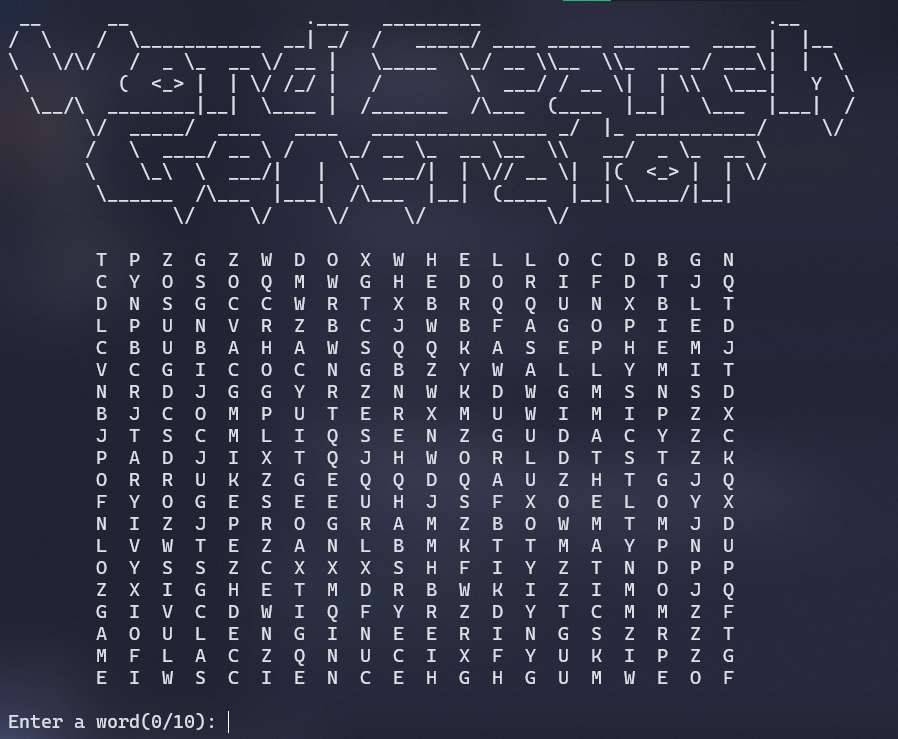

# **Word Search Puzzle Game**

**Overview of The Program**

This is a Word Search Puzzle Game made in C program completely. In this game user try to find hidden words in a 20x20 grid. The words are placed horizontally, vertically and diagonally in the grid. Then the grid is filled with random uppercase alphabets. User input words they find and then the game removes them from the grid until all of the words are discovered.

**Features**

-   **Word Placement In Different Orientation**: Words are randomly placed in the grid in different direction like horizontal, vertical or diagonal.
-   **Interactive Gameplay**: Players input words and then the game removes that word from the grid.
-   **Random Letter Placement In The Grid**: The Grid position which are filled with dot characters are later filled up with random uppercase alphabets.
-   **Game Progress Tracker:** The Program shows a player progress next to the input prompt.
-   **ASCII Art Display**: Display ASCII art in top of the grid.
-   **Error Handling**: Basic file error checking for the ASCII art file. Also some error checking in different algorithm in the code.

**Words in the Puzzle**

The game uses the following 10 words:

-   HELLO
-   WORLD
-   PROJECT
-   PROGRAM
-   GAME
-   COMPUTER
-   SCIENCE
-   ENGINEERING
-   MATHEMATICS
-   PHYSICS

**Requirements**

-   A C compiler.

**How to Compile and Run**

1. Clone the GitHub repository:

    ```powershell
    git clone "https://github.com/SafwatSadiq/10.Word_Search_Generator.git"
    ```

2. Open the directory
3. Compile using the following code:

    ```powershell
    gcc main.c -o main.exe
    ```

4. Run the program by running the following code:

    ```powershell
    .\main.exe
    ```

**Edit to Change The Experience**

-   You can Edit the GRID_ROW and GRID_COL size to change the grid size
-   You can Edit the word list and also TOTAL_WORDS to change the word count

**Image of The Program**


**Future Improvements**

I will try to improve this app by adding the following features in the program:

-   More words and random word selection.
-   Better UI with difficulty.
